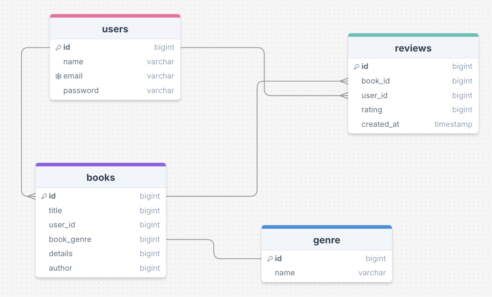

# Changelog - Praktijkopdracht

## 14 October 2025

### User Stories
1. Als gebruiker wil ik de status van mijn boek kunnen aanpassen, zodat ik mijn leesvoortgang kan bijhouden.
2. ls gebruiker wil ik reviews kunnen schrijven, zodat ik mijn mening en ervaring kan delen.
3. Als gebruiker wil ik reviews kunnen filteren op genre, zodat ik reviews vind van boeken die mij interesseren.
4. Als gebruiker wil ik reviews kunnen opslaan, zodat ik mijn favoriete reviews terug kan vinden.
5. Als gebruiker wil ik een overzicht van mijn boeken per status, zodat ik mijn collectie kan organiseren.
6. Als gebruiker wil ik mijn boeken kunnen bewerken of verwijderen, zodat ik mijn collectie up-to-date kan houden.
7. Als admin wil ik boeken en reviews van anderen kunnen beheren, zodat ik ongepaste content kan verwijderen.
8. Als admin wil ik genres kunnen toevoegen, bewerken of verwijderen, zodat ik de database actueel kan houden.
9. Als admin wil ik gebruikers goed kunnen filteren, zodat ik het platform efficiënt kan beheren.

